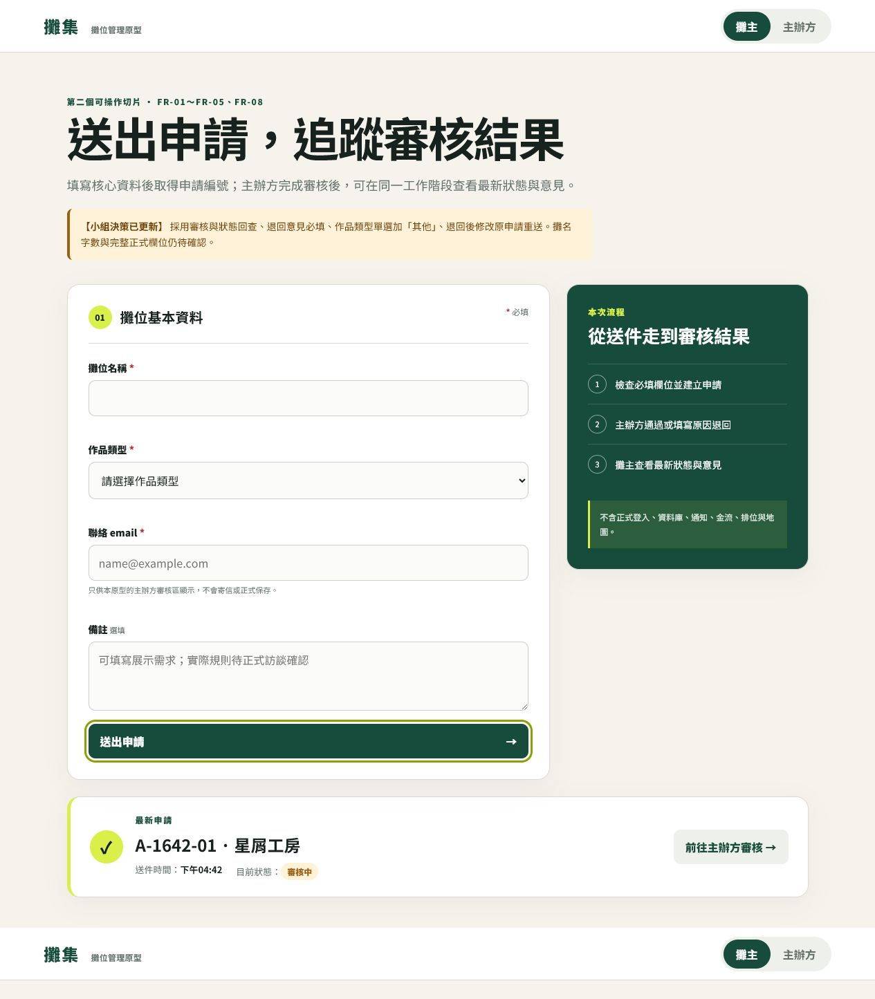
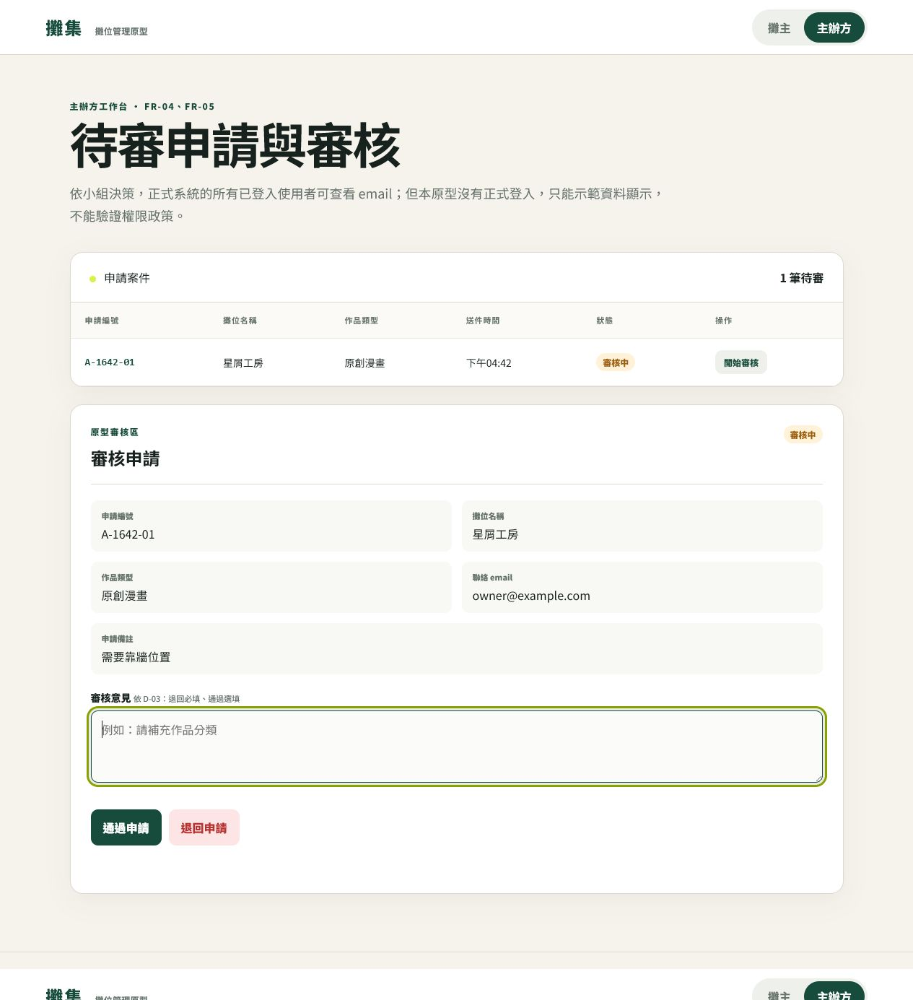
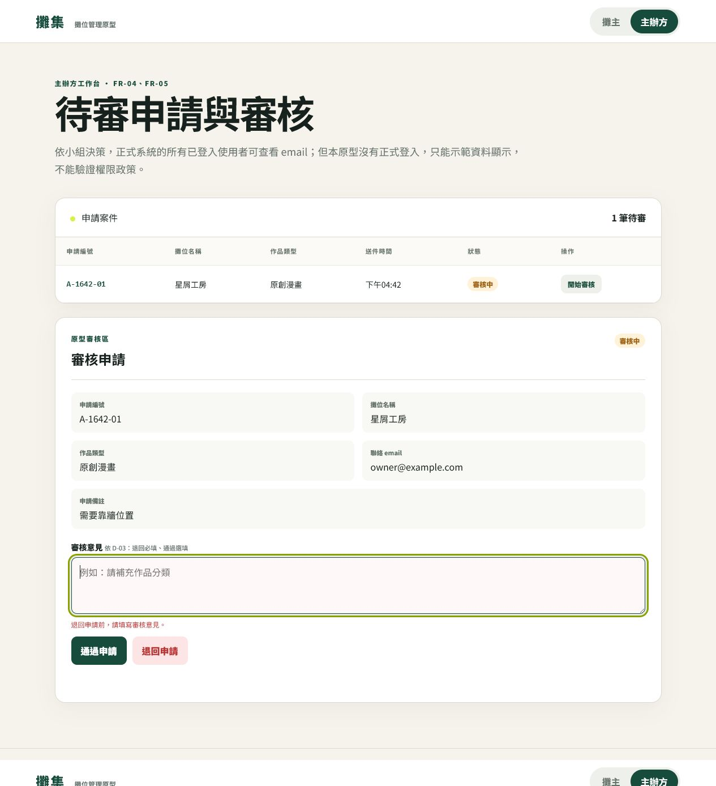
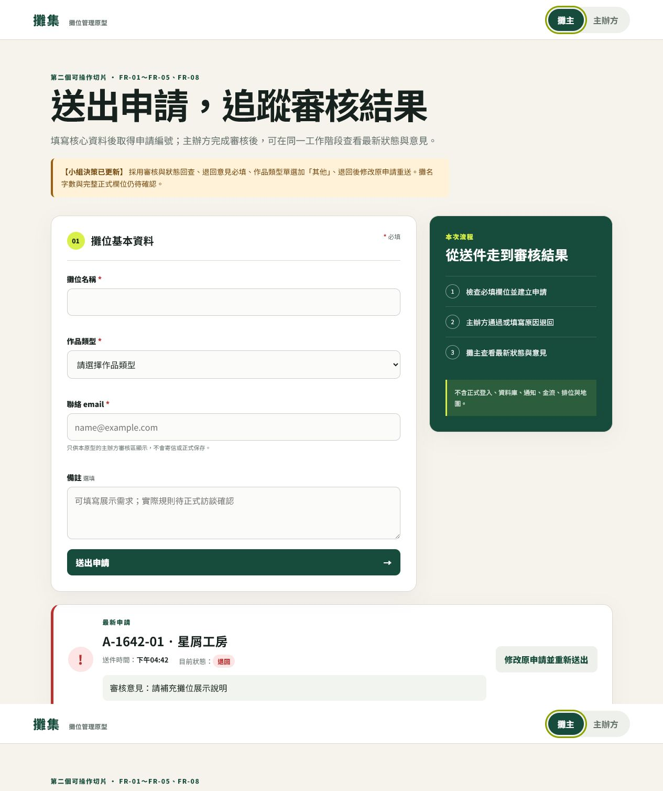
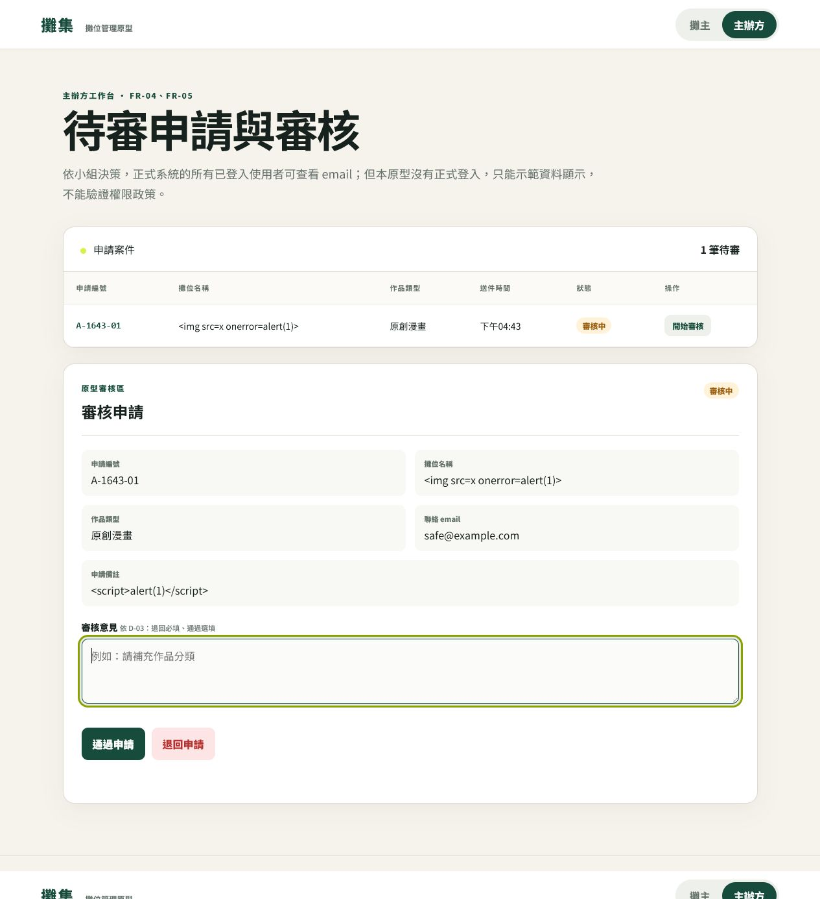

# 115/07/15 手動驗收執行證據

## 執行環境與重現前提

- 測試頁面：`revised_or_second_working_slice/index.html`，以本機伺服器開啟。
- 瀏覽器：Codex 桌面版內建瀏覽器，桌面版面。
- 資料保存：只在頁面記憶體；重新載入頁面即重設。
- 資料限制：只用假資料，不含正式登入、資料庫、通知、金流、排位或地圖。
- 編號限制：申請編號與時間依執行當下產生；重測不要求固定為 `A-1642-01`，但同一流程內不得換號。

## MAT-10：正常送件

1. 攤位名稱輸入「星屑工房」。
2. 作品類型選「原創漫畫」。
3. email 輸入 `owner@example.com`。
4. 備註輸入「需要靠牆位置」。
5. 按「送出申請」。
6. 實際結果：顯示 `A-1642-01`、下午 04:42、審核中；無欄位錯誤。
7. 判定：AC-01-01、AC-03-01 通過。

## MAT-11：待審與審核資料

1. 延續 MAT-10，按「前往主辦方審核」。
2. 確認待審計數為 1，清單顯示同一申請。
3. 按「開始審核」。
4. 實際結果：審核區顯示編號、星屑工房、原創漫畫、`owner@example.com`、需要靠牆位置，以及通過／退回按鈕。
5. 判定：AC-04-01、AC-05-01 通過。

## MAT-12：空白退回例外

1. 延續 MAT-11，審核意見保持空白。
2. 按「退回申請」。
3. 實際結果：顯示「退回申請前，請填寫審核意見。」；案件仍為審核中，待審仍為 1。
4. 判定：AC-05-04 通過。

## MAT-13：全空白意見邊界

1. 在審核意見輸入恰好 3 個空白字元。
2. 按「退回申請」。
3. 實際結果：系統將空白修剪後視為未填，顯示同一必填提示；案件仍為審核中，待審仍為 1。
4. 判定：AC-05-05 通過。

此測試與 MAT-12 的可見結果相同，畫面證據沿用 `07_mat12_blank_return_error.jpg`；操作輸入差異保留於本節，不以成功結果覆蓋。

## MAT-14：有效退回與攤主回查

1. 審核意見輸入「請補充攤位展示說明」。
2. 按「退回申請」，確認主辦方待審變為 0。
3. 切換至「攤主」。
4. 實際結果：同一申請編號顯示退回，並顯示逐字相同的審核意見。
5. 判定：AC-05-03、AC-08-02 通過。

## MAT-15：特殊輸入安全性

1. 重新載入頁面。
2. 攤位名稱輸入 ``。
3. 備註輸入 ``。
4. 作品類型選「原創漫畫」，email 輸入 `safe@example.com`。
5. 送件、切換主辦方並開始審核。
6. 實際結果：沒有警示視窗或圖片；清單與審核區完整顯示兩段原始字串，流程未中斷。
7. 判定：AC-NFR-08-01／NFR-08 的前端範圍通過；不外推為後端安全已完成。

## 結果摘要

| 類型 | 筆數 | 結果 |
|---|---:|---|
| 正常 | 3 | MAT-10、MAT-11、MAT-14 均通過 |
| 例外 | 1 | MAT-12 通過 |
| 邊界 | 1 | MAT-13 通過 |
| 非功能性 | 1 | MAT-15 通過 |
| 本次總計 | 6 | 6 通過、0 失敗 |

歷史失敗 MAT-06、修正待辦 IMP-02／IMP-03 與重測 MAT-06R 仍保留於 `manual_acceptance_test.md`，未刪除。
